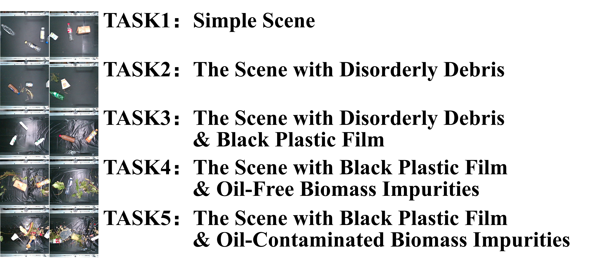

# KWG-CL
This is a continual learning dataset for 2D grasping in kitchen waste sorting scenarios, as described in the following paper:

which is in **the process of peer review**.
# Introduction
This dataset is built upon the [KWG2024](https://github.com/HNUsong/KWG2024) and the [Xrobot](https://github.com/TDA-2030/XRobot)-based robotic system. Specifically, we trained the grasping model on KWG2024, allowing the Xrobot-based system to autonomously grasp and label targets. The labels were then manually reviewed and corrected to create the KWG-CL dataset. This dataset is divided into 5 tasks. According to the task ID number, the complexity of the image background will gradually increase. Specifically, in TASK1, there are a total of 418 RGB and depth images; in TASK2, there are a total of 484 RGB and depth images; in TASK3, there are a total of 512 RGB and depth images; in TASK4, there are a total of 434 RGB and depth images; and in TASK5, there are a total of 480 RGB and depth images. All the images were captured via a Realsense D455 camera.

# How was it collected?
We enabled the robot system to autonomously annotate the data in real scenarios based on the model trained on KWG2024, as depicted in the following:

This system assigns a value of 0 to the last digit of each data to mark incorrect grasps, and a value of 1 to mark correct grasps. Errors are displayed in red, while correct grasps are displayed in green.
# How was it annotated?
All the labels autonomously annotated by the sorting system are subject to manual verification. We will first determine whether the labels are correct, and for objects that have been incorrectly annotated or not annotated at all, we will manually annotate them. The annotation tool we employ is modified from the [grasp-rectangle-labelling tool](https://github.com/ulaval-damas/grasp-rectangle-labelling). This tool possesses functions such as image confirmation, annotation, assisted annotation, and adding serial numbers. The process of manual annotation confirmation and modification is presented as follows:

# Attention!
Since our paper related to this dataset is currently in the peer review process and as the dataset is being utilized for further experiments, we are temporarily releasing only a part of the dataset.
# License
Shield: [![CC BY 4.0][cc-by-shield]][cc-by]

This work is licensed under a
[Creative Commons Attribution 4.0 International License][cc-by].

[![CC BY 4.0][cc-by-image]][cc-by]

[cc-by]: http://creativecommons.org/licenses/by/4.0/
[cc-by-image]: https://i.creativecommons.org/l/by/4.0/88x31.png
[cc-by-shield]: https://img.shields.io/badge/License-CC%20BY%204.0-lightgrey.svg

